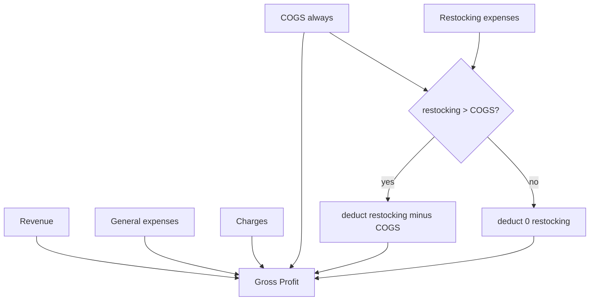

# Gross profit with excess restocking only

## Problem (unchanged)

- **COGS** = sold units × `unitOrderPriceCents` from batches
- **Restocking** = manual supplier expense records

Deducting **full** restocking **and** COGS double-counts inventory cost up to `min(restocking, COGS)`. The fix is not “never deduct restocking” — it is “deduct restocking only when it exceeds COGS for the period.”

---

## Option B — how it works

For the **same date range** as revenue/COGS (sales dashboard range or network 30d):

```
excessRestockingCents = max(0, restockingCents - cogsCents)

grossProfitCents =
  revenueCents
  - cogsCents
  - generalAndChargeExpensesCents
  - excessRestockingCents
```

Equivalent shorthand:

```
grossProfitCents = revenue - max(cogs, restocking) - generalAndCharges
```

### Intuition

| Restocking | COGS | Excess deducted | Total inventory cost removed from revenue |
|------------|------|-----------------|-------------------------------------------|
| 80,000 | 100,000 | 0 | 100,000 (COGS only) |
| 150,000 | 100,000 | 50,000 | 150,000 (COGS + excess) |
| 100,000 | 0 | 100,000 | 100,000 (all restocking when nothing sold) |

- When **restocking ≤ COGS**: COGS already reflects product cost sold; the restocking cash in this window is treated as already “covered” — **no extra restocking deduction**.
- When **restocking > COGS**: you bought more (in expense records) than you recognized as sold cost — deduct only the **gap** as extra inventory spend (building stock, timing, or missing batch costs).



### Worked example (same 30-day window)

- Revenue: 500,000
- COGS: 200,000
- Restocking expenses: 280,000
- General + charges: 30,000

```
excessRestocking = max(0, 280,000 - 200,000) = 80,000

grossProfit = 500,000 - 200,000 - 30,000 - 80,000 = 190,000
```

Compare to **today (bug)**: deducts full 280,000 restocking → gross profit 190,000 lower than it should be if COGS already captured 200k of inventory cost.

Compare to **exclude all restocking**: gross profit = 500,000 - 200,000 - 30,000 = **270,000** — ignores the 80k of “extra” purchasing not yet flowing through COGS.

---

## Previous period / deltas

Apply the same rule to the comparison window:

```
previousExcessRestocking = max(0, previousRestocking - previousCogs)
previousGrossProfit = previousRevenue - previousCogs - previousGeneralCharges - previousExcessRestocking
```

---

## Implementation

### 1. Sales repository ([`sales.repository.impl.ts`](src/lib/repositories/sales/sales.repository.impl.ts))

**Expense query** (~lines 219–237): split aggregates:

- `totalRestockingCents` / `previousRestockingCents` — `expense_type = 'restocking'`
- `totalOperatingExpensesCents` / `previousOperatingExpensesCents` — `general` + `charge` (rename from misleading `chargeMetrics` / all-expense sum)

**After fetch:**

```typescript
const excessRestockingCents = Math.max(0, restockingCents - cogsCents);
const grossProfitCents =
  revenue - cogs - operatingExpenses - excessRestockingCents;
```

**API** ([`sales.repository.ts`](src/lib/repositories/sales/sales.repository.ts), [`queries/sales.ts`](src/lib/queries/sales.ts)):

- Add `totalRestockingCents`, `excessRestockingCents` (and previous-period twins)
- `totalExpensesCents` → either keep as operating-only or document as “deducted from gross profit” breakdown

### 2. Network repository ([`network.repository.impl.ts`](src/lib/repositories/network/network.repository.impl.ts))

- Add org-level `totalRestockingCents30d` query (filter `restocking`)
- Per-branch: `restockingCents30d` alongside existing `expensesCents30d` (or replace branch expense sum with typed splits)
- Branch + totals:

```typescript
const excess = Math.max(0, restocking - cogs);
grossProfit = revenue - cogs - generalAndCharges - excess;
```

Keep `totalChargeExpensesCents30d` as today; operating = general + charge queries (exclude restocking from the old “all expenses” gross-profit path).

### 3. UI

[`sales-performance-content.tsx`](src/components/dashboard/sales-performance-content.tsx) KPI subtitle, e.g.:

`COGS … • Operating … • Excess restocking …` (only show excess line when > 0, optional)

[`network-overview-content.tsx`](src/components/dashboard/network-overview-content.tsx) — same pattern.

Expenses page: unchanged (full restocking still listed).

### 4. Verification checklist

| Scenario | Expected gross profit inventory deduction |
|----------|----------------------------------------|
| Restocking 50k, COGS 120k | 120k (COGS only) |
| Restocking 120k, COGS 50k | 120k (50k COGS + 70k excess) |
| Restocking 80k, COGS 0 | 80k (all restocking) |
| No restocking | COGS only |

---

## Caveats (document in UI tooltip or internal comment)

- **Same-period comparison** is a proxy, not full inventory accounting (opening/closing stock can differ).
- Restocking on **expense date** vs COGS on **sale date** can misallocate across months; acceptable for dashboard KPI unless you later add inventory-value reconciliation.
- If restocking is logged but **batch `unitOrderPriceCents` is wrong/zero**, COGS understates and excess restocking over-corrects — data quality on receive still matters.

---

## Files to touch

| File | Change |
|------|--------|
| [`src/lib/repositories/sales/sales.repository.impl.ts`](src/lib/repositories/sales/sales.repository.impl.ts) | Restocking + operating expense splits; excess formula |
| [`src/lib/repositories/sales/sales.repository.ts`](src/lib/repositories/sales/sales.repository.ts) | New metric fields |
| [`src/lib/queries/sales.ts`](src/lib/queries/sales.ts) | Types for new fields |
| [`src/lib/repositories/network/network.repository.impl.ts`](src/lib/repositories/network/network.repository.impl.ts) | Restocking sums + excess formula (org + branch) |
| [`src/lib/repositories/network/network.repository.ts`](src/lib/repositories/network/network.repository.ts) | New fields if exposed |
| [`src/components/dashboard/sales-performance-content.tsx`](src/components/dashboard/sales-performance-content.tsx) | Subtitle / optional excess label |
| [`src/components/dashboard/network-overview-content.tsx`](src/components/dashboard/network-overview-content.tsx) | Subtitle / optional excess label |
